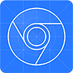

### Hello there! I'm Ksenia 👋

<!--
**KseniaPomeschikova-QA/KseniaPomeschikova-QA** is a ✨ _special_ ✨ repository because its `README.md` (this file) appears on your GitHub profile.

Here are some ideas to get you started:

- 🔭 I’m currently working on ...
- 🌱 I’m currently learning ...
- 👯 I’m looking to collaborate on ...
- 🤔 I’m looking for help with ...
- 💬 Ask me about ...
- 📫 How to reach me: ...
- 😄 Pronouns: ...
- ⚡ Fun fact: ...
-->

### About me :star:
- В тестировании с 2023 года
- Фанат Гарри Поттера, Атаки титанов и комиксов Bubble
- Слушаю русское инди во время работы
- Веду фандомные аккаунты в соц.сетях

### Contacts :email:
  - Email: Pomechshikova1995@yandex.ru
  - Telegram: <a href="https://t.me/militantis">@militantis</a>

### Skills :muscle:

 <code></code>
 <code></code>
 <code></code>
 <code></code>
 <code></code>
 <code></code>
 <code></code>
 <code></code>

### Git stats :part_alternation_mark:

 

